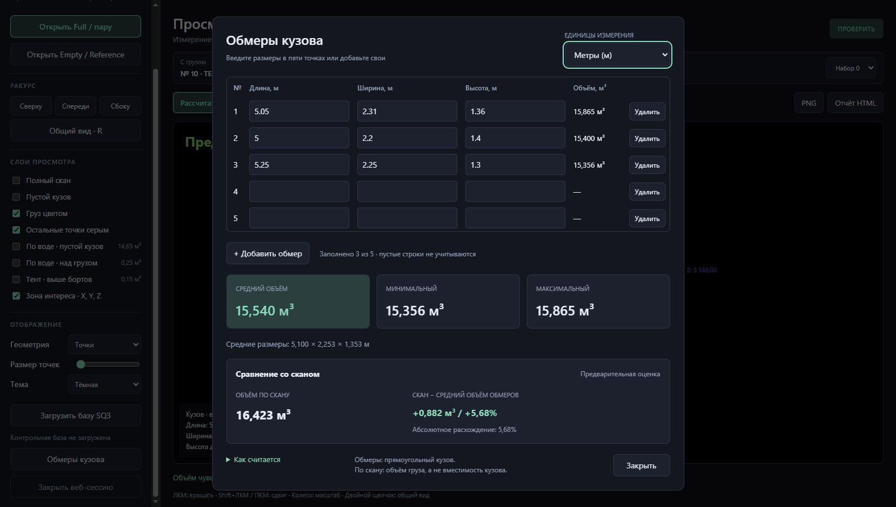
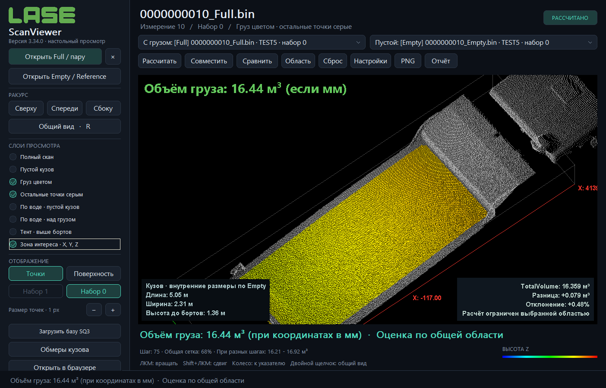

# LaseScanViewer 3.34.0 — обмеры и интерфейс

## Изменения

Веб-версия получила «Обмеры кузова»: пять начальных строк, добавление/удаление от 1 до 200, метры и сантиметры, десятичную запятую, аккуратный перевод единиц, средний/минимальный/максимальный объём, средние размеры и сравнение со сканом в м³ и процентах. Формулы, проверка ввода и перевод единиц выполняются существующим C++-модулем `manual_volume.hpp`, общим с настольной версией. Среднее считается по объёмам заполненных строк. При ошибке агрегированный результат скрывается; пустые строки не учитываются.

В настольной версии слева расположены независимые слои Full, Empty, цветной груз, серый фон, две заливки по воде, тент и зона интереса. Отдельные кнопки открывают Full/пару и Empty/Reference. Явно выбранная база заменяет прежнюю базу и сохраняет Full активным. Прокрутка панели и переход Tab позволяют добраться до всех кнопок на небольшом экране. Тема, чёрный 3D-фон, сохранение камеры и прежние параметры расчёта сохранены.

## Проверки

- Windows x64 и x86: существующие проверки BIN, совмещения, ROI, слоёв, SQ3, ручных обмеров, PNG/HTML/PDF/PLY и сохранения камеры.
- Новый настольный интерфейс: отсутствие обрезанных названий, доступность кнопок при 1120×820, прокрутка, переключение восьми слоёв через реальные команды кнопок без изменения камеры/объёма, явный выбор Reference и отклонение Full в роли базы.
- HTTP-калькулятор x64/x86: пустые и неполные строки, запятая/точка, среднее объёмов, диапазон 1–200, ошибки ввода, сто переводов м → см → м без накопления ошибок, доступность во время совмещения, сохранение результата скана.
- Браузер: ручной ввод, смена единиц, добавление/удаление, сохранение строк при повторном открытии, ошибки ввода, предварительная оценка, темы, сохранение камеры, визуальная проверка.
- Немедленная смена цвета заголовка Windows при смене темы. В двух темах PNG 3D-окна побайтово совпадают.

Контрольные пересчёты совпали с замороженными результатами предыдущего алгоритма с допуском 10⁻¹⁰ м³:

| Данные | Измерение | Сборка | Объём, м³ |
|---|---:|---|---:|
| dmu | 10 | x64 | 16.422869179822584 |
| dmu | 10 | x86 | 16.422869179822584 |
| n-gk new | 14387 | x64 | 6.817431116973879 |

В этом выпуске алгоритмы совмещения и объёма не изменялись. Полный набор контрольных пар заново не прогонялся; это изменение интерфейса. Прежняя 3.33.0 сохранена и проверена по SHA256. Проверенные исходники, результаты тестов и исполняемые файлы включены в портативный архив. BIN и SQ3 пользователя в архив не входят.

