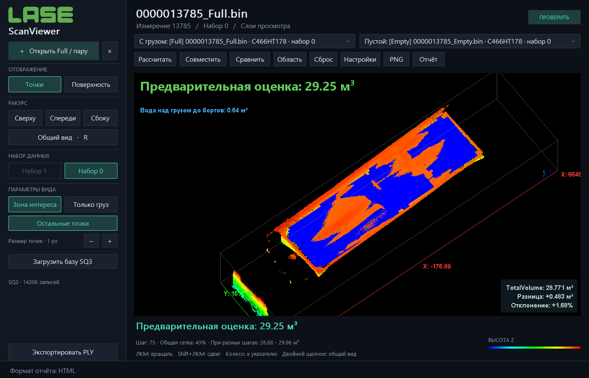
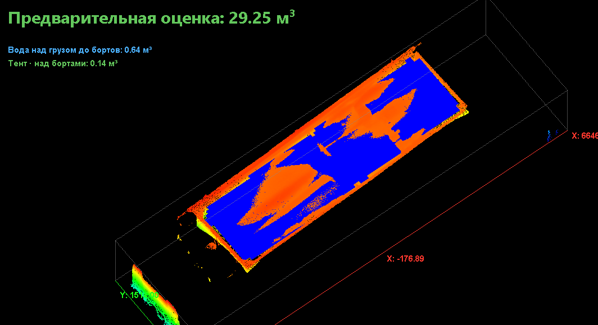

<p align="center">
  
</p>

# LaseScanViewer

**Просмотр 3D-сканов кузова, совмещение Full/Empty и оценка объёма груза.**

Портативное приложение на C++17 для Windows 10/11. Открывает поддерживаемые BIN-файлы LASE, показывает облако точек и поверхность, отделяет груз от кузова и сравнивает результат с `TotalVolume` из базы измерений.

**Версия: 3.27.0** · **Windows x64 / x86** · **Обработка локально**



## Возможности

- Загрузка Full, Empty и Reference через диалог, перетаскивание или командную строку. Автоматическое открытие соседнего Empty с тем же номером.
- Совмещение с поиском поворота 0–360°, включая разворот на 180°, и уточнением по неподвижным частям кузова.
- Оценка объёма по разности поверхностей, адаптивная сетка, ограниченное восстановление пропусков и проверка чувствительности результата.
- Цветные точки груза, серый фон, наложение сканов, поверхность и независимое включение слоёв.
- Зона интереса с границами и подписями X, Y, Z; выбор области расчёта.
- Заполнение «по воде»: вместимость пустого кузова и свободное пространство над грузом до бортов.
- Виртуальный тент: выделение части груза выше уровня бортов с отдельным значением объёма.
- Контрольная база SQ3: сверка с `TotalVolume`, разница в м³ и процентах.
- Экспорт PNG, PLY и автономных отчётов HTML / PDF.
- Тёмная и светлая темы; фоновые вычисления с прогрессом; выбор CPU или GPU + CPU.

Совмещение и расчёт сохраняют текущие поворот, масштаб и сдвиг камеры. Окно 3D-просмотра остаётся чёрным при любой теме.

## Запуск

Скачайте `LaseScanViewer-3.27.0-Windows.zip` из [**выпуска 3.27.0**](https://github.com/artyomshutoff/LaseScanViewer/releases/tag/v3.27.0) или раздела [**Releases**](https://github.com/artyomshutoff/LaseScanViewer/releases/latest). Распакуйте архив и запустите подходящую сборку:

| Файл | Для каких систем |
|---|---|
| `LaseScanViewer.exe` | Windows 10/11 x64; предпочтительно для больших сканов |
| `LaseScanViewer-Portable.exe` | Windows 10 x86 и Windows 10/11 x64 через WoW64 |

Установщик, права администратора, Python, Qt и отдельный Visual C++ Redistributable не нужны. Для обычного запуска достаточно одного EXE: иконка, логотип и необходимые ресурсы встроены. Сканы выбираются отдельно.

Требуются процессор Intel/AMD и работающий OpenGL-драйвер. GPU-вычисления дополнительно требуют совместимого OpenCL-драйвера с двойной точностью. Если подходящей видеокарты нет, используйте CPU. Windows ARM, Linux и macOS не входят в проверенную поставку.

По умолчанию включена тёмная тема. Выбор темы и формата отчёта сохраняется в `LaseScanViewer.ini` рядом с EXE, если каталог доступен для записи. Ранее сохранённая тема имеет приоритет над стартовой.

## Первый расчёт

1. Нажмите **Открыть Full / пару** и выберите `*_Full.bin`. Соседний `*_Empty.bin` с тем же номером загрузится автоматически. Если его нет, откройте Empty или Reference отдельно.
2. Проверьте выбор файлов **С грузом** и **Пустой**. Для обоих выберите одинаковый набор координат — 0 или 1.
3. В **Настройки → Параметры расчёта** проверьте единицы координат. По умолчанию предполагаются миллиметры; подтвердите это по размерам объекта.
4. Нажмите **Рассчитать**. Если пара ещё не совмещена, программа сначала выполнит совмещение. Дождитесь завершения прогресса.
5. Нажмите **Сравнить** и проверьте неподвижные части: Full показан оранжевым, Empty — голубым. Кнопка **Совместить** повторно запускает выравнивание.
6. При необходимости выделите кузов через **Область**, уточните параметры и повторите расчёт. Сохраните изображение, геометрию или отчёт.

Поддерживаются проверенные структуры BIN LASE. Расширение `.bin` само по себе не гарантирует совместимость с произвольным бинарным файлом.

## Управление просмотром

| Действие | Управление |
|---|---|
| Вращение | ЛКМ и движение мыши; движение вверх вращает скан вниз |
| Перемещение | Shift + ЛКМ, ПКМ или средняя кнопка мыши |
| Приближение к указателю | Колесо мыши |
| Общий вид | Двойной щелчок, `R`, `Home` или кнопка **Общий вид** |
| Открыть BIN | `Ctrl + O` |
| Экспорт PLY | `Ctrl + S` |
| Точки / поверхность | `1` / `2` |
| Отменить выделение области | `Esc` |

При вращении и перемещении отображается курсор с четырьмя стрелками. Переключение слоёв сохраняет положение камеры.

## Слои, вода и виртуальный тент

Откройте **Настройки → Слои просмотра**. Full, Empty, груз, остальные точки, вода и тент включаются независимо. **Остальные точки** показывают фон Full серым и не добавляют его к объёму груза.

| Слой | Что означает значение |
|---|---|
| По воде: пустой кузов | Оценка вместимости до уровня перелива через измеренные борта Empty |
| По воде: над грузом | Оценка свободного пространства между поверхностью Full и уровнем бортов |
| Виртуальный тент | Геометрический объём выделенного груза выше горизонтальной плоскости бортов |

Вода отображается синим. Тент можно показывать вместе с любыми другими слоями. Чтобы видеть только превышение над бортами, отключите остальные слои вручную.

Тент моделируется без провисания; это не физическая симуляция ткани. При неопределённом уровне бортов опция недоступна. Нулевое превышение означает, что выделенный груз не выступает над выбранной плоскостью. Вода и тент не изменяют основной объём груза.



## Сверка с TotalVolume

Нажмите **Загрузить базу SQ3** и выберите `TVM_Measurement_Data_Base.sq3`. База открывается только для чтения. Справа снизу появятся контрольный объём и разницы:

```text
Разница, м³ = рассчитанный объём − TotalVolume
Отклонение, % = (рассчитанный объём − TotalVolume) / TotalVolume × 100
```

Положительная разница означает, что оценка программы больше контрольного значения. При `TotalVolume = 0` процент не определяется.

Запись выбирается по MeasurementID; при отсутствии прямого совпадения допускается единственное совпадение Incoming/OutgoingMeasurementID. При доступных метках проверяется соответствие автомобиля. Неоднозначные записи и некорректные значения не принимаются как контрольные. Используется `TotalVolume`, а не `CorrectedTotalVolume`.

Загруженная база служит для сверки и не подставляет контрольный объём в расчёт. Даже при включённом тенте сравнивается **общий объём груза**, а не превышение над бортами. После изменения базы загрузите её заново.

## Расчёт и точность

Геометрический расчёт использует общую XY-сетку совмещённых Full и Empty. Положительная разность высот поверхностей умножается на площадь ячеек. Проверяются несколько разрешений и положений сетки; небольшие замкнутые пропуски могут восстанавливаться. Большие и открытые разрывы не заполняются автоматически.

Для подходящих сканов и настроек итоговая оценка дополнительно уточняется встроенной моделью, обученной на контрольных парах. Эта поправка не меняет совмещение, облако точек или геометрию PLY. Поэтому итоговая оценка и геометрический интеграл могут различаться; подробности доступны в отчёте. Модель не использует загруженную пользователем SQ3-базу, имена файлов или номера измерений для получения ответа.

В 3.27 расширен поиск продольного совмещения по стенкам при частичном совпадении. На 73 новых парах `n-gk 2` среднее абсолютное отклонение от TotalVolume уменьшилось с 2,217% до 1,982%; на всех 344 контрольных парах — с 0,904% до 0,854%. Прежние результаты не ухудшились. Максимальное расхождение осталось 42,984% на 12837 и включено в статистику. Встроенная модель не переобучалась; старые пары ранее участвовали в её обучении, а проблемная новая пара использовалась при разработке поиска. Условия и результаты каждой пары: [отчёт проверки 3.27](CONTROL-3.27-report.md), [CSV](CONTROL-3.27-results.csv).

**Фиксированная погрешность для любых сканов не гарантируется.** Результат зависит от единиц, совмещения, полноты поверхности, выбранной области и соответствия новой геометрии обучающим данным. Проверки на наборах, использованных при разработке, не заменяют независимое испытание.

- «Совпадение» и «Общая сетка» — показатели геометрического покрытия, а не процент точности объёма.
- Диапазон «При разных шагах» показывает чувствительность к сетке, а не доверительный интервал.
- При ненадёжном совмещении расчёт доступен, но помечается как предварительная оценка.
- Цветные точки показывают измерения груза; поверхность может также включать восстановленные интеграционные ячейки.
- Для координат в миллиметрах: `1 м³ = 1 000 000 000 мм³`. Ошибка масштаба влияет на объём в третьей степени.

## Экспорт

| Формат | Назначение |
|---|---|
| PNG | Изображение текущего окна 3D-просмотра |
| PLY | Точки или геометрия, выбранные текущим режимом экспорта |
| HTML | Автономный отчёт со встроенным изображением и доступным для копирования текстом |
| PDF | Отчёт A4 с параметрами, изображением, объёмами и сверкой с базой |

Формат отчёта выбирается в **Настройки → Формат отчёта**, затем нажмите **Отчёт**. PDF создаётся самим приложением без внешнего принтера; страницы растровые, текст в них не выделяется. Исходные BIN и SQ3 не изменяются.

## CPU и GPU

По умолчанию используется **CPU**. В **Настройки → Устройство вычислений** можно выбрать **GPU + CPU**. Выбор применяется к следующему совмещению.

GPU через OpenCL ищет соответствия при переборе гипотез. Точное уточнение, интегрирование объёма и расчёт воды остаются на CPU. При ошибке GPU предусмотрен возврат к CPU. На x64 часть работы с дескрипторами реализована SSE2-ассемблером.

GPU не обязательно быстрее: на проверенной GTX 1650 Ti гибридный режим уступал CPU. Выбирайте режим по времени обработки ваших данных.

## Сборка из исходников

Нужны Windows, PowerShell и **LLVM-MinGW с UCRT**, включающий инструменты x64 и i686. SQLite и OpenCL-заголовки находятся в `src/vendor/`; отдельные SDK для них не требуются.

Из корня проекта:

```powershell
.\build.ps1 -Toolchain 'C:\Tools\llvm-mingw' -OutputDir dist
```

Скрипт создаёт `dist/LaseScanViewer.exe`, `dist/LaseScanViewer-Portable.exe` и диагностический `build/inspect.exe`. Используется C++17, оптимизация `-O2` и статическая линковка библиотек компилятора. Windows-библиотеки остаются системными. Путь по умолчанию рассчитан на локальный каталог `.tools`; при другой установке укажите `-Toolchain` явно.

| Каталог / файл | Содержимое |
|---|---|
| `src/main.cpp`, `src/ui.hpp`, `src/v2.hpp` | Win32-интерфейс, OpenGL и управление приложением |
| `src/registration.hpp` | Совмещение сканов |
| `src/analysis.hpp`, `src/volume.hpp`, `src/cargo.hpp` | Разность поверхностей, объём и выделение груза |
| `src/water_fill.hpp`, `src/water_loaded.hpp`, `src/virtual_tarp.hpp` | Вода и тент |
| `src/control_database.hpp`, `src/pdf_report.hpp` | Контрольная база и PDF |
| `tests/` | Проверки геометрии, совмещения, экспорта и вычислительных режимов |
| `scripts/` | Проверки, упаковка и вспомогательные инструменты |
| `assets/` | Иконка программы |

Пример проверки без реальных BIN:

```powershell
New-Item -ItemType Directory -Force build | Out-Null
& 'C:\Tools\llvm-mingw\bin\clang++.exe' -std=c++17 -O2 -static tests/tarp325_test.cpp -o build/tarp-test.exe
.\build\tarp-test.exe
```

Некоторые тесты требуют реальных Full/Empty и контрольных баз; они не входят в публичную поставку автоматически. Отчёты отдельных версий описывают конкретные наборы и условия проверки, а не универсальные гарантии точности.

## Сообщить об ошибке

В Issue укажите версию программы, Windows, CPU/GPU-режим, тип и набор скана, параметры расчёта и шаги воспроизведения. Приложите скриншот и, если можете поделиться данными, минимальную пару Full/Empty. Для проблемы с объёмом укажите единицы координат и источник контрольного значения.

История разработки: [README-LaseScanViewer.md](README-LaseScanViewer.md). Подготовка репозитория: [публикация на GitHub](docs/PUBLISHING.md).
